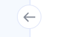
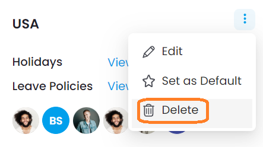
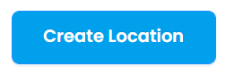

# Vacation-manager

  <a href="https://vacation-manager.netlify.app/">🚀 Deploy (Demo)</a>  
  <a href="https://www.figma.com/file/wBej1ryKixAUozkXrGd2B2/Vacation-manager">🖼️ Figma template</a>

## About

An application page where you can manage employee cards sorted by location.

## Stack Technology

- Project is written with `Typescript` and `React.js` library.

`Typescript` - adds statical typification, helps with team-developing and reduce bugs amount in future.

`React.js` - "makes it painless to create interactive UIs". Fast and Component-Based.

- `Redux` @4.2.0 and `Redux-Toolkit` as nowadays the go-to way to use Redux are used for state management.

- `Ant Design` library with ready for use components.

- `SASS` preprocessor (.scss syntax/ css-modules) was used for component stylisation.

- `.eslint.json` and `.prettier` were used for maintenance code-quality and unified code-writing.

## What can you do?

- Toggle settings menu by clicking this button 
- Delete the card using this button 
- Create a new card using this button 
- Enjoy a high quality layout 😀
